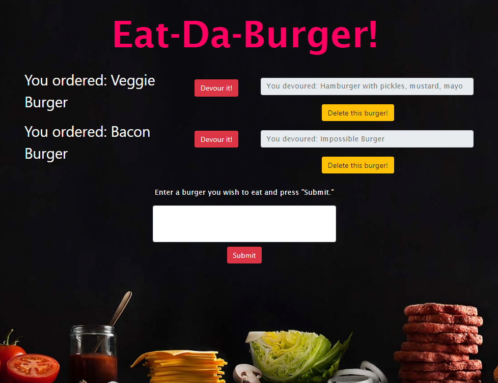

# Eat-Da-Burger

created by Jennifer Gaumnitz
____________

Eat-Da-Burger! is a restaurant app that lets users input the names of burgers they would like to eat. Whenever a user submits a burger's name, the app displays the burger on the left side of the page -- waiting to be devoured. Each burger in the waiting area also has a "Devour it!" button. When the user clicks it, the burger moves to the right side of the page. The app will store every burger in a database, whether devoured or not. To delete the burger from the database, the user can click on the "Delete this burger!" button below the burger they wish to remove from the list.

- - - -
Heroku deployed app: https://polar-beyond-03817.herokuapp.com/

GitHub repository: https://github.com/JLGaumnitz/burger
- - - -

### How You Can Get Started With This Project ###

<strong>To use the app:</strong> 

Simply go to the Heroku link above. Input the names of burgers you would like to eat. Submit a burger's name, and the app displays the burger on the left side of the page -- waiting to be devoured. Each burger in the waiting area also has a "Devour it!" button. When you click it, the burger moves to the right side of the page. To delete the burger from the database, you can click on the "Delete this burger!" button below the burger you wish to remove from the list.

<strong>To create the app from my files in my GitHub repository:</strong> 

To install and use this application yourself, clone the GitHub repository. 

You will need to have installed:

* Node
* And these dependencies: express, express-handlebars, and mysql

Before running the server.js file using node.js, you will need to run "npm install." 

Then run "node server.js" at the command line to begin the server, and then navigate to localhost:8000 in your browser to see the HTML home page and proceed from there.

### Why the Project is Useful ###

  The app fulfills a homework assignment for University of Kansas Coding Boot Camp, August 2019 to February 2020. Besides allowing me to continue working with Node.js and npm packages, the assignment also allowed me to work with express, express-handlebars, and MySQL.

### Where Users Can Get Help with This Project ###

  Questions? Contact Jennifer Gaumnitz at jlgaumnitz@gmail.com

### Who Maintains and Contributes to the Project ###

  Jennifer Gaumnitz created the project. I probably will not update it again after completing this assignment. 
